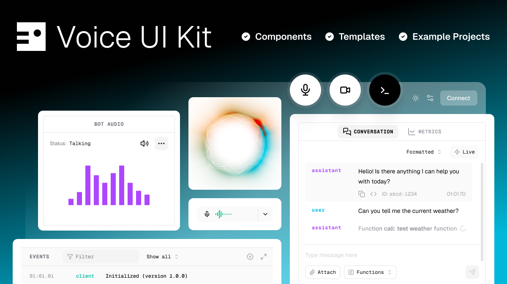

# Pipecat Voice UI Kit

[](https://voiceuikit.pipecat.ai)
[](https://voiceuikit.pipecat.ai)
[](https://github.com/pipecat-ai/voice-ui-kit)
[](LICENSE)

<!-- TODO: point the Storybook badge at the hosted Storybook once it's live -->



The UI layer for voice agents. Voice UI Kit is a
[shadcn registry](https://ui.shadcn.com/docs/registry) of components for
building on [Pipecat](https://github.com/pipecat-ai/pipecat)'s real-time
platform — mic and camera controls, live transcripts with karaoke text,
voice-tuned audio visualizers, session state, and more, already wired to the
client. Components install as source into your project, styled by your theme
and yours to edit.

> [!IMPORTANT]
> **v1.0 rebuild.** The npm package `@pipecat-ai/voice-ui-kit` (≤0.13.x) is the
> previous generation — see the `main` branch. This branch distributes
> components via the shadcn CLI instead of npm.

## What's inside

- 🎛️ **Session controls** — connect button driven by transport state, mic
  control with push-to-talk and a live visualizer, camera and screen-share
  toggles with preview tiles, device pickers, DTMF keypad
- 📈 **Audio visualizers** — canvas bar, radial, and wave renderers sharing a
  voice-tuned mel-band core
- 💬 **Conversation UI** — live scrolling transcript with roles and karaoke
  text, message composer, caption-style overlay for bot speech
- 🔍 **Session insight** — client/agent status rows, session metadata, bot
  audio output with a shared volume store
- 🪝 **Bootstrap hook** — `use-pipecat-app` builds the client and owns the
  connect lifecycle, lazy-loading whichever transport you pick
- 🧱 **Blocks** — larger assembled surfaces (console, …) composed from the
  components — _coming soon_
- 🎨 **Your theme, your code** — stock Base UI primitives, `data-state`
  attributes on everything, a tiny semantic token set you can restyle

Every component ships two layers in one file: a connected export wired to the
Pipecat client, and a props-driven `*View` export for custom state management.

## Prerequisites

- **Node.js** 22+
- **React** 19
- **Tailwind CSS** 4
- **[shadcn/ui](https://ui.shadcn.com/docs/installation)** — Base UI style (the
  CLI 4.x default)

> [!NOTE]
> Everything else — shadcn primitives, the Pipecat client SDKs, npm deps —
> installs automatically with each component. The only optional install is a
> `@pipecat-ai/*-transport` package for connecting (see
> [transports](#pipecat--connected-or-optional)).

## Installation

1. Register the `@pipecat` namespace in your `components.json`:

```jsonc
{
  "registries": {
    "@pipecat": "https://voiceuikit.pipecat.ai/r/{name}.json",
  },
}
```

2. Add components:

```bash
npx shadcn@latest add @pipecat/user-audio-control @pipecat/conversation
```

Files land in `components/pipecat/`, dependencies install, and any component
theme tokens merge into your globals.css.

3. Wrap your app in a `PipecatClientProvider`
   ([docs](https://docs.pipecat.ai/client/react/introduction)) — every
   component works under a bare provider. Or let the kit do it:

```tsx
"use client";

import { PipecatClientProvider } from "@pipecat-ai/client-react";

import { ConnectButton } from "@/components/pipecat/connect-button";
import { Conversation } from "@/components/pipecat/conversation";
import { UserAudioControl } from "@/components/pipecat/user-audio-control";
import { usePipecatApp } from "@/hooks/use-pipecat-app";

export default function VoiceApp() {
  const { client, connect, disconnect } = usePipecatApp({
    connectParams: { endpoint: "/api/start" },
  });

  if (!client) return null;

  return (
    <PipecatClientProvider client={client}>
      <Conversation />
      <UserAudioControl />
      <ConnectButton onConnect={connect} onDisconnect={disconnect} />
    </PipecatClientProvider>
  );
}
```

## Pipecat — connected, or optional

The connected exports read the Pipecat client from context, so they need a
`PipecatClientProvider`. But every component also exports a `*View` variant
(`UserAudioControlView`, `ConversationView`, …) that is pure props-driven UI —
no provider, no connection, no side effects. Drive the views from mocks, tests,
recorded sessions, or a non-Pipecat backend entirely.

The client SDKs (`@pipecat-ai/client-js`, `@pipecat-ai/client-react`) install
automatically with each component. **Transport packages stay optional** — they
load on demand, so install only the one your app actually connects with:

| Transport             | Package                              |
| --------------------- | ------------------------------------ |
| SmallWebRTC (default) | `@pipecat-ai/small-webrtc-transport` |
| Daily                 | `@pipecat-ai/daily-transport`        |
| WebSocket             | `@pipecat-ai/websocket-transport`    |
| MoQ                   | `@pipecat-ai/moq-transport`          |

A missing transport surfaces as a client error naming the exact install
command rather than a build failure.

## Theme tokens

Components rely on your shadcn theme. Two small semantic groups are added via
registry `cssVars` (and are yours to restyle):
`--active-background`/`--active-foreground` and
`--inactive-background`/`--inactive-foreground` for media on/off states, plus
`--agent`/`--client` for conversation roles.

## Documentation

- **[Component docs](https://voiceuikit.pipecat.ai)** — live previews,
  configurable examples, and installation for every item
- **Storybook** — every component and state in isolation _(hosted link coming
  soon; run locally with `pnpm dev`)_
- **[Pipecat client SDK](https://docs.pipecat.ai/client/react/introduction)** —
  the provider, hooks, and transports the kit builds on
- **[Pipecat](https://docs.pipecat.ai)** — build the agent on the other side of
  the conversation

## Contributing

The monorepo is the registry plus two host apps that consume it like a real
project:

- `packages/registry` — the product: `registry.json` + source under
  `src/components/pipecat/`, shared modules in `src/lib/`, hooks in
  `src/hooks/`, vitest suites in `tests/`
- `apps/docs` — Fumadocs site: component docs with live previews, serves the
  registry at `/r/{name}.json`
- `apps/storybook` — Storybook 10 dev host set up as a real Base UI shadcn
  consumer; also hosts the vitest run

```bash
pnpm install
pnpm dev        # storybook on :6006 + docs on :3600
pnpm build      # registry build + storybook build + docs build
pnpm typecheck && pnpm lint && pnpm test
```

To add a registry item:

1. Create `packages/registry/src/components/pipecat/<name>.tsx` with a
   co-located `<name>.stories.tsx`
2. Add a test in `packages/registry/tests/<name>.test.tsx`
3. Add the item's manifest entry to `packages/registry/registry.json`
4. Run `node apps/docs/scripts/sync-registry.mjs`, then
   `pnpm typecheck && pnpm lint && pnpm test`

## Built with

[Base UI](https://base-ui.com) ·
[Tailwind CSS v4](https://tailwindcss.com) ·
[TypeScript](https://www.typescriptlang.org) ·
[shadcn CLI](https://ui.shadcn.com/docs/cli) ·
[Fumadocs](https://fumadocs.dev) ·
[Storybook 10](https://storybook.js.org) ·
[Vitest](https://vitest.dev) ·
[Turborepo](https://turborepo.dev)

## Community & support

- 💬 **[Discord](https://discord.gg/pipecat)** — chat with the Pipecat team and
  community
- 🐛 **[GitHub issues](https://github.com/pipecat-ai/voice-ui-kit/issues)** —
  bugs and feature requests

## License

BSD-2-Clause

---

<div align="center">

Made with ❤️ by the [Pipecat](https://pipecat.ai) team

</div>
